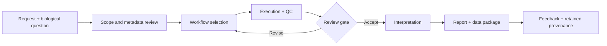
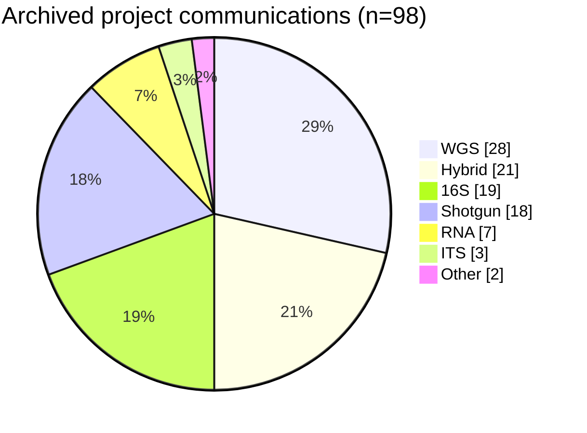

## Operating model

As team lead, I connect technical execution with project communication: clarify the biological question, select the analysis profile, monitor quality, review interpretation, and package a result that can be traced back to inputs and parameters.

## Archived project mix

The counts below are a **conservative lower bound** derived from 98 distinct order codes found in archived project communications. They show breadth of operations, not the total number of samples or every project completed.

| Analysis type | Distinct order codes |
| ------------- | -------------------: |
| WGS           |                   28 |
| Hybrid        |                   21 |
| 16S           |                   19 |
| Shotgun       |                   18 |
| RNA           |                    7 |
| ITS           |                    3 |
| Other         |                    2 |

## What is standardized

- Required metadata and input checks before compute starts
- Environment and parameter capture for reproducibility
- Technical quality gates before biological interpretation
- Structured review and deliverable packaging
- A feedback path for reruns, clarification, and retained provenance

## Boundary

Email-derived order counts can undercount work that used different communication channels, and they should not be interpreted as sample counts, revenue, or independently audited business metrics.
