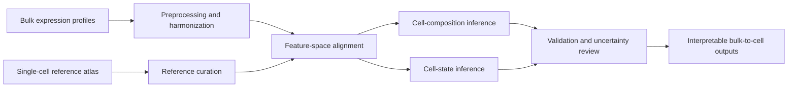

## Wittgenbio research scope

At **Wittgenbio**, I develop **bulk-to-single-cell inference** approaches and contribute to **virtual-cell research**. This work is separate from my bacteriophage research at Microiotix. The case study below reports only versioned, reproducible evidence available in the current research checkout; it does not use illustrative performance charts.

## Current evidence snapshot

| Public reference cohort |   Cells |  Genes | Cell types | Samples | EDA gate                                                                 |
| ----------------------- | ------: | -----: | ---------: | ------: | ------------------------------------------------------------------------ |
| GSE176078               |  52,774 | 17,882 |         15 |      26 | Integer-likeness PASS; UMAP evaluated on an 8,000-cell bounded subsample |
| SCPCP000003             | 275,875 | 60,319 |         13 |      37 | Integer-likeness PASS; UMAP evaluated on an 8,000-cell bounded subsample |

These values document reference scale and preprocessing readiness, not predictive performance. The public page will gain UMAP, cell-composition, or model-comparison figures only when the corresponding reproducible artifacts are available for disclosure.

## Bulk-to-single-cell workflow



The analysis is organized around compatibility between the bulk dataset and the single-cell reference. Reference composition, feature overlap, batch effects, tissue or condition mismatch, and uncertainty are reviewed before cell-type or cell-state estimates are interpreted.

## Virtual-cell workflow

```mermaid
flowchart LR
    cellular_data[Cellular and molecular data] --> data_model_scope[Data and modeling scope]
    biological_question[Biological question] --> data_model_scope
    data_model_scope --> cell_representation[Computational cell representation]
    cell_representation --> train_evaluation_design[Train and evaluation design]
    train_evaluation_design --> virtual_cell_model[Virtual-cell model]
    virtual_cell_model --> state_response_evaluation[State and response evaluation]
    state_response_evaluation --> biological_review[Biological plausibility review]
    biological_review --> research_hypotheses[Research hypotheses]
    class data_model_scope,cell_representation,train_evaluation_design,virtual_cell_model,state_response_evaluation,biological_review project-tool-node
```



The virtual-cell track focuses on whether a computational representation preserves biologically useful cell-state information and whether predicted states or responses remain reliable outside the data used to build the model.

## Evaluation principles

- Separate model fitting from evaluation data and document reference or condition coverage.
- Compare predictions with measurable biological signals rather than relying on latent-space appearance alone.
- Report where cell types, states, tissues, perturbations, or experimental conditions are underrepresented.
- Treat generated cell states and perturbation responses as hypotheses until they are externally or experimentally validated.

## What is measured next

The evaluation plan separates three questions that are often conflated: whether inferred proportions agree with matched references, whether reconstructed expression preserves held-out signal, and whether uncertainty increases under tissue, condition, or cell-type mismatch. Results remain non-headline until the exact split, reference coverage, baseline, and uncertainty evidence are all versioned together.

## Boundary

Bulk-to-single-cell outputs are model-based estimates, not direct single-cell measurements. Virtual-cell predictions do not establish biological mechanism or treatment response without independent data and experimental validation.
