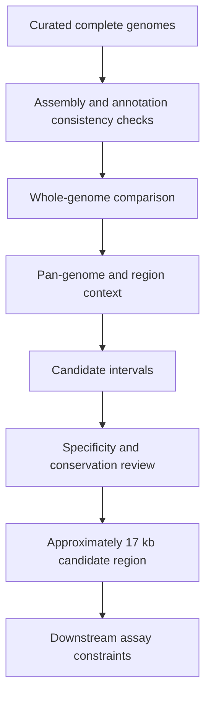

## Objective

Identify a genomic region that distinguishes the target group while remaining practical for downstream marker or assay development.

## Workflow

## Approach

I compared complete genomes, inspected region-level context, and filtered candidate differences against conservation, specificity, and downstream assay constraints. This moved the work from an undirected list of variants toward a bounded region that could be reviewed biologically and experimentally.

## Outcome and evidence

The analysis prioritized an approximately **17 kb candidate region** for follow-up. The useful artifact was not only the interval itself, but the traceable reasoning from genome selection through comparative evidence and practical constraints.

## Boundary

Computational prioritization does not establish diagnostic performance. Wet-lab verification, inclusivity/exclusivity testing, and evaluation on broader strain diversity are required before deployment as a marker.
