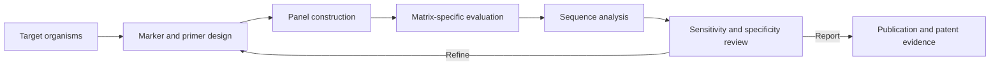

## Objective

Support simultaneous detection and identification of foodborne pathogens in complex matrices using a targeted next-generation sequencing panel.

## Development loop



## Contribution

I contributed bioinformatics and comparative-genomics analysis to panel development and evaluation, including marker-oriented work and the interpretation of NGS outputs across food and environmental sample contexts.

## Evidence

- Two peer-reviewed papers published in 2023: one on agricultural wastewater and one on fermented foods.
- One joint patent contribution in 2022 for an NGS-based primer set and detection method for foodborne bacteria.
- The corresponding records are listed on the [Publications]() page.

## Boundary

Publication and patent records document the collaborative result. They do not imply sole authorship, sole invention, or universal performance across matrices that were not evaluated.
