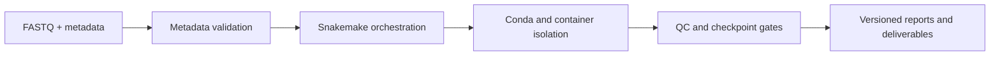
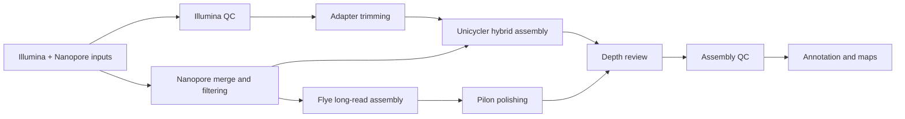

## Problem

Analysis services tend to fragment as each assay accumulates separate scripts, environments, quality checks, and report conventions. The result may be scientifically sound but difficult to reproduce, review, or operate consistently.

## My role

I designed and maintained a shared Snakemake platform that separates common execution concerns from assay-specific logic. The system supports 16S, ITS, WGS, and hybrid-assembly profiles while keeping inputs, environments, checkpoints, logs, and deliverables traceable.

## Shared execution



## 16S and ITS

The amplicon profiles share the same QIIME 2 execution contract in the Sanigen pipeline evidence, with profile-specific parameters coming from `config_16S.yaml`, `config_ITS.yaml`, and `qiime_commands.yaml`.



## WGS

The active WGS path in the inspected Sanigen workflow evidence is the Illumina assembly and review branch wired through `WGS_snakefile`, `illumina_trim.smk`, `WGS_assembly.smk`, `WGS_depth.smk`, `Assembly_QC.smk`, `WGS_annotation.smk`, and `abricate.smk`.

```mermaid
flowchart LR
    wgs_reads[Illumina WGS reads] --> illumina_qc[Illumina QC]
    illumina_qc --> adapter_trimming[Adapter trimming]
    adapter_trimming --> spades_assembly[SPAdes assembly]
    spades_assembly --> assembly_filtering[Assembly filtering]
    assembly_filtering --> depth_remap[Depth remapping]
    depth_remap --> assembly_qc[Assembly QC]
    assembly_qc --> annotation_and_amr[Annotation and AMR/VF review]
    class illumina_qc,adapter_trimming,spades_assembly,assembly_filtering,depth_remap,assembly_qc,annotation_and_amr project-tool-node
```



## Hybrid

The active hybrid path in the inspected Sanigen workflow evidence supports both `unicycler` and `flye` branches, with Flye optionally polished through Pilon before the shared depth, QC, annotation, and mapping steps.



## Engineering decisions

- **One execution contract:** consistent metadata validation, logging, checkpoints, and output structure.
- **Isolated environments:** Conda for tool-level reproducibility, with Docker or Apptainer where stronger isolation is useful.
- **Profile-specific logic:** assay methods remain modular instead of being forced into a single monolithic script.
- **Reviewable failure:** failed checks stop or flag the run before interpretation and delivery.

## Not mapped as active workflow nodes

The Sanigen evidence also distinguishes a few non-active or not-currently-wired items that I intentionally left out of the active workflow tables above.

| Item     | Evidence in `sanigen_pipeline`                                                                                                                         | Status used here      |
| -------- | ------------------------------------------------------------------------------------------------------------------------------------------------------ | --------------------- |
| Medaka   | Pinned in `workflow/config/containers.yaml` as `medaka:1.11.3`, but no active rule include in the inspected profile Snakefiles                         | configured-only       |
| GTDB-Tk  | Implemented in `workflow/rules/gtdbtk.smk`, but not included by the inspected `WGS_snakefile` or `HYB_snakefile`                                       | implemented-not-wired |
| PhiX     | Test-only artifacts appear under `test_wgs/3-1.Trimmomatic_PhiXFiltered` and `toy_data/PhiX.fasta`, not in the inspected active WGS Snakefile includes | documented-only       |
| Filtlong | No active rule or config hit appeared in the inspected workflow files, so it is excluded from the active map                                           | not-applicable        |

## Outcome and evidence

The platform consolidated four major analysis types under a common operational model and became the basis for recurring microbial-genomics work. The public [Bioinformatics_pipeline](https://github.com/Bruce-BC/Bioinformatics_pipeline) repository shows a subset of the workflow approach; client data and production-only components are not public.

## Boundary

This page describes architecture and operating practice, not a claim that every assay uses identical methods or thresholds. Tool choice and acceptance criteria remain assay- and project-specific.
