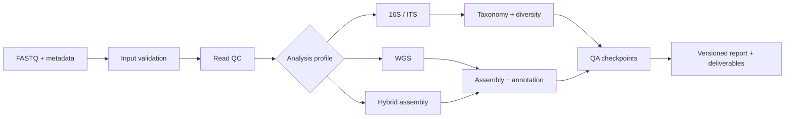

## Problem

Analysis services tend to fragment as each assay accumulates separate scripts, environments, quality checks, and report conventions. The result may be scientifically sound but difficult to reproduce, review, or operate consistently.

## My role

I designed and maintained a shared Snakemake platform that separates common execution concerns from assay-specific logic. The system supports 16S, ITS, WGS, and hybrid-assembly profiles while keeping inputs, environments, checkpoints, logs, and deliverables traceable.

## Workflow

## Engineering decisions

- **One execution contract:** consistent metadata validation, logging, checkpoints, and output structure.
- **Isolated environments:** Conda for tool-level reproducibility, with Docker or Apptainer where stronger isolation is useful.
- **Profile-specific logic:** assay methods remain modular instead of being forced into a single monolithic script.
- **Reviewable failure:** failed checks stop or flag the run before interpretation and delivery.

## Outcome and evidence

The platform consolidated four major analysis types under a common operational model and became the basis for recurring microbial-genomics work. The public [Bioinformatics_pipeline](https://github.com/Bruce-BC/Bioinformatics_pipeline) repository shows a subset of the workflow approach; client data and production-only components are not public.

## Boundary

This page describes architecture and operating practice, not a claim that every assay uses identical methods or thresholds. Tool choice and acceptance criteria remain assay- and project-specific.
