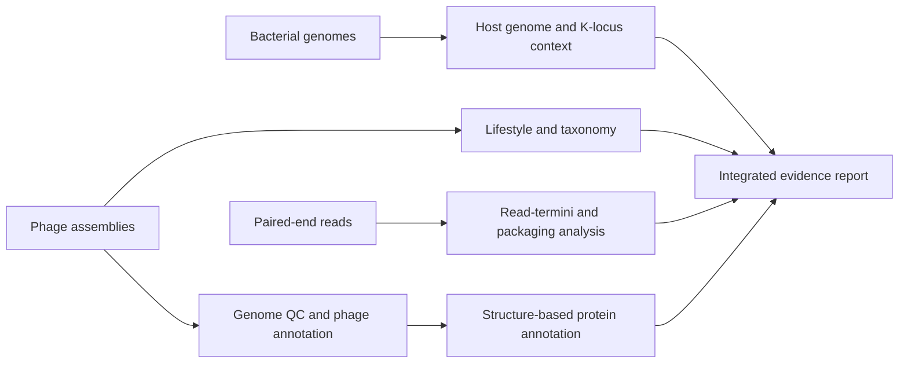
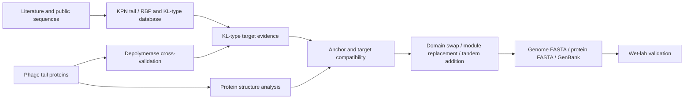

## Current-role scope

At Microiotix, my work connects **bacterial genome analysis**, **phage genome analysis**, _Klebsiella pneumoniae_ **tail/RBP and KL-type database construction**, **protein structure analysis**, and **in silico phage design**. The case study below is translated and condensed from an internal analysis report; sample identifiers and internal reference IDs have been removed.

## Genome evidence workflow



The workflow keeps independent evidence streams separate until integration. Taxonomy combines nearest-neighbor and graph-clustering evidence; lifestyle combines hallmark-gene review with two machine-learning approaches; packaging is determined from raw-read termini rather than inferred from terminase annotation alone.

## Tail, KL-type, and structure-design workflow



## Evidence highlighted from the report

- Built a **7,759-sequence capsule-target reference resource** covering depolymerase, tailspike, and receptor-binding proteins, with source traceability, confidence labels, and experimentally verified KL targets explicitly marked.
- In an anonymized four-genome study, independent evidence converged on **lytic Przondovirus** genomes with **short DTR packaging** and 180-183 bp terminal repeats.
- Assigned three capsule targets with **95.4-98.8% sequence identity** to experimentally supported references while retaining unresolved targets as data gaps instead of forcing labels.
- Used independent protein-language-model classifiers to distinguish structural tail proteins from candidate depolymerases, then checked the calls with sequence, domain, and structure evidence.
- Used **ProstT5 and Foldseek** with experimental PDB references to detect conserved folds at sequence identities too low for ordinary sequence search and to review catalytic-domain boundaries.
- Prioritized an engineering candidate using same-genus context, a **129-aa anchor alignment spanning 99.2% of the region**, experimental structure support, label-consistency checks, and predicted structural retention.

## Boundary

The database and design bench prioritize testable hypotheses. KL-type prediction should be checked against host-genome evidence such as Kaptive results, and predicted RBP folding, adsorption, host range, and lytic activity still require wet-lab validation.
