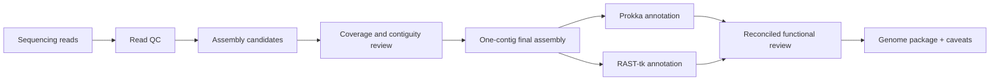

## Objective

Produce reviewable bacteriophage genome assemblies and annotations while keeping assembly confidence separate from biological interpretation.

## Workflow

## Approach

- Compared assembly candidates using contiguity, read support, and genome-scale plausibility.
- Reached single-contig final assemblies across the assessed sample set.
- Supplemented Prokka output with RAST-tk evidence instead of treating one annotation source as definitive.
- Evaluated ONT and Nextflow-based processing as part of a more portable workflow direction.

## Outcome

The work produced compact, reviewable genome packages and a clearer separation between assembly evidence, annotation evidence, and downstream biological claims.

## Boundary

A one-contig assembly is not automatically a complete, circular, or correctly oriented genome. Completion claims still require read-support and terminal-structure checks appropriate to the phage and sequencing design.
