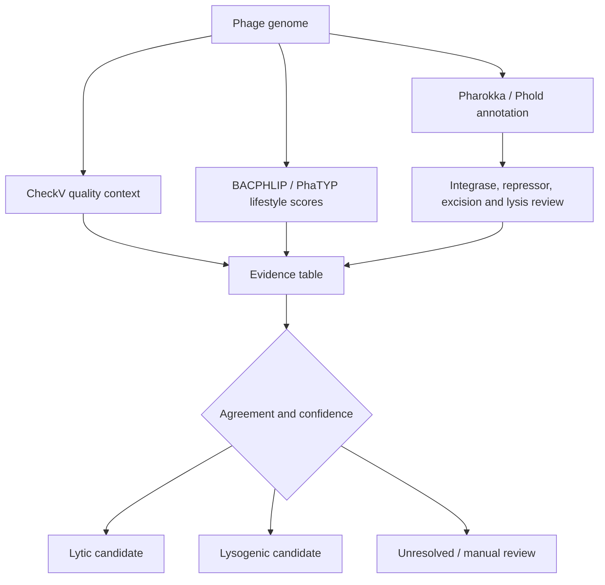
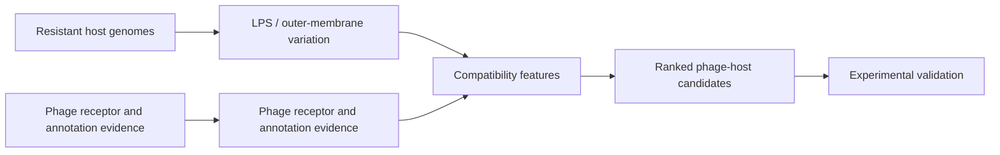

## Research question

Can existing tools be combined into an end-to-end system that distinguishes lytic and lysogenic phages while preserving conflicting evidence—and then helps prioritize phages relevant to resistant bacterial hosts?

## Evidence workflow



## Design principle

The prototype keeps tool outputs and gene-level signals visible. A consensus label is useful only when the system can explain whether it came from sequence quality, lifestyle classifiers, hallmark genes, or their agreement. Conflicting cases are routed to review instead of being silently forced into a binary answer.

## Host-range extension

A related candidate-discovery layer considers bacterial surface biology—such as LPS and outer-membrane gene variation—when prioritizing phages that may remain relevant against resistant strains. This is a hypothesis-ranking mechanism, not proof of infection.



## Current status and publication potential

This is an **independent research prototype**. It becomes publication-grade when tested against an external, leakage-controlled benchmark and compared with both individual tools and simple baselines. Useful novelty would come from demonstrably better calibration, interpretable disagreement handling, or experimentally supported host-range prioritization—not merely chaining existing programs.

## Boundary

Lifestyle prediction and host-range prediction answer different questions. Neither genomic similarity nor bacterial receptor variation alone proves adsorption, infection, or lytic activity; wet-lab validation remains essential.
